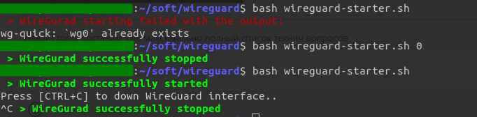

# Wireguard-Starter
Script to handle wireguard start/stop as single process with Ctrl+C vpn stopping.

### Usage:
1. Open the file 'wireguard-starter.sh' and modify 2 variables as you need

```bash
################ Variables ##############

# your password, or allow command in sudoers file, if empty - native way with password requesting on start
my_password="123"

# wireguard preconfigured link, possible values:
#   - name according to the system configuration file like "/etc/wireguard/wg0.conf" 
#   - custom path to interface configuration file, e.g. "~/soft/wireguard/wg0.conf"
#wg_link=~/soft/wireguard/wg0.conf
wg_link="wg0"

...

#########################################
```

2. To start preconfired Wireguard interface run the terminal command [any preferrable: bash, sh, zsh]:

```bash
bash wireguard-starter.sh
```
script will run `wg-quick up` command and will wait for Ctrl+C interruption shortkey. After Ctrl+C script will down wireguard interface.
This might be useful if you need to turn of/off the Wireguard often enough or just like to have the single vpn window.


3. To stop Wireguard interface started outside this script execute the command:
```bash
bash wireguard-starter.sh 0
```
or
```bash
bash wireguard-starter.sh down
```
### Visual example:


